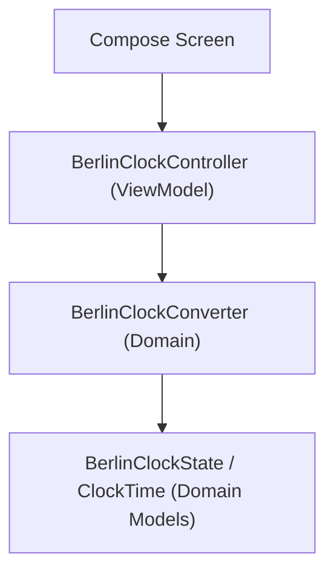
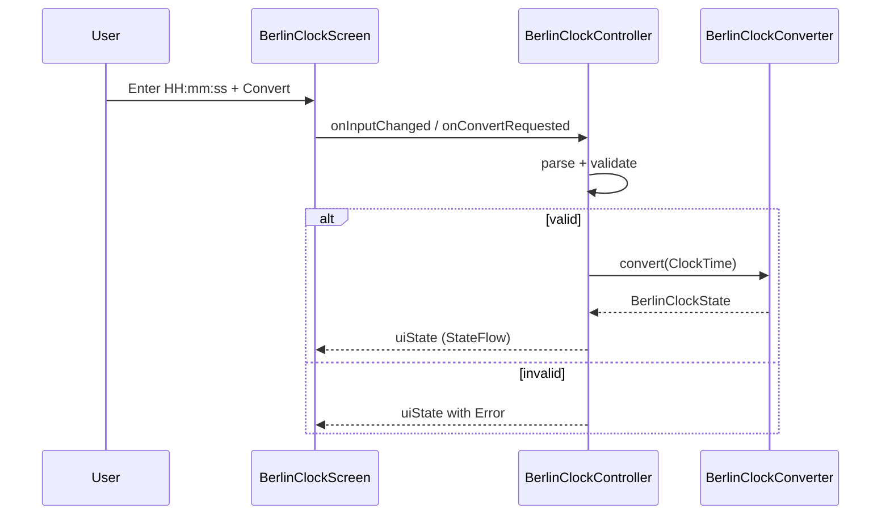

# Berlin Clock Kata Android App

A Kotlin + Jetpack Compose implementation of the Berlin Clock kata with a full lamp-block UI and validated `HH:mm:ss` input flow.

## Table of Contents
- [Requirements](#requirements)
- [Quick Start](#quick-start)
- [How to Test](#how-to-test)
- [Kata Rules Implemented](#kata-rules-implemented)
- [Architecture](#architecture)
- [Diagrams](#diagrams)
- [Testing Strategy (TDD)](#testing-strategy-tdd)
- [Notable Design Decisions](#notable-design-decisions)
- [Known Limitations / Future Improvements](#known-limitations--future-improvements)
- [Assessment Notes](#assessment-notes)

## Requirements
- Android Studio: recent stable release (Iguana+ recommended)
- JDK: 17
- Android SDK:
  - `minSdk 24`
  - `targetSdk 34`
  - `compileSdk 34`

## Quick Start
1. Clone this repository.
2. Open it in Android Studio.
3. Let Gradle sync complete.
4. Build the debug APK:

```bash
./gradlew assembleDebug
```

5. Run the `app` configuration on an emulator or a connected device.

## How to Test
Run unit tests:

```bash
./gradlew testDebugUnitTest --no-daemon
```

Run formatting/style checks:

```bash
./gradlew ktlintCheck --no-daemon
```

Optional full local validation:

```bash
./gradlew clean testDebugUnitTest ktlintCheck assembleDebug --no-daemon
```

## Kata Rules Implemented
- Seconds lamp parity (on for even seconds)
- 5-hour row
- 1-hour row
- 5-minute row with quarter-hour markers in red (3/6/9)
- 1-minute row

Canonical sample coverage:
- `00:00:00`
- `13:17:01`
- `23:59:59`

## Architecture
Feature-first structure with separation of concerns:

- `features/berlinclock/domain/...`
  - `BerlinClockConverter`
  - `ClockTime`, `BerlinClockState`, lamp state models
  - no Compose/UI imports

- `features/berlinclock/presentation/...`
  - `BerlinClockController` (`ViewModel` + `StateFlow`)
  - `BerlinClockUiState` + input status modeling
  - Compose screen rendering and user interactions

Key points:
- Domain has no UI dependencies.
- Presentation uses `ViewModel + StateFlow`.
- Input parsing/validation is handled in the presentation controller.

## Diagrams
### Layer Diagram


### Input-to-Render Flow


## Testing Strategy (TDD)
The implementation was built incrementally:
- rule-by-rule tests first
- minimal implementation to pass each rule
- refactor commit after green tests
- presentation wiring after domain stabilization

Controller tests cover parsing and validation behavior for valid, malformed, and out-of-range inputs.

## Notable Design Decisions
- `ViewModel + StateFlow` for lifecycle-safe UI state.
- Last valid clock state is preserved when input is invalid.
- Berlin Clock is rendered as full colored lamp blocks (seconds circle + rows).

## Known Limitations / Future Improvements
- Add Compose UI instrumentation tests.
- Improve accessibility semantics (screen reader labels, touch target metadata).
- Optionally extract parsing to a dedicated parser/use case.
- Optionally add CI workflow if remote validation is needed.

## Assessment Notes
- Commit history is intentionally incremental to show reasoning and working style.
- Ensure repository metadata remains anonymized (no personal-identifying details in commit/profile metadata).
